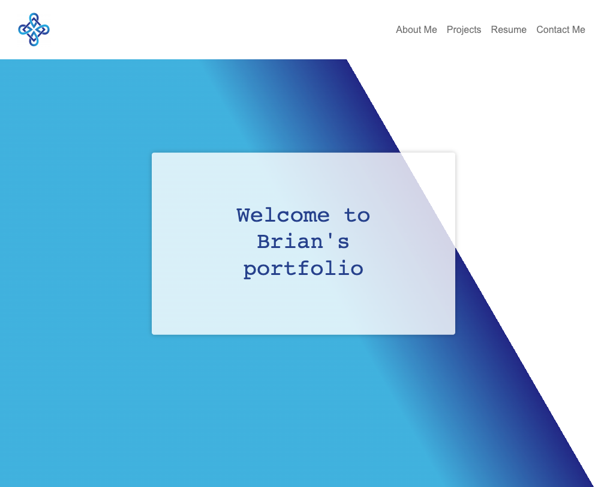

# Brian Albright
# React Portfolio

### This is my portfolio in React. I originally built it as part of an assignment for the full stack coding bootcamp that I took from UT Austin. Since then, I have modified it to satisfy various requests from career advisors and because I wanted to change some things from what I had to do for the assignment. I plan to make future changes to the style and add some pages as I practice coding and work on projects. 

## Source Code

### I originally used starter code from an activity in the React section of our bootcamp repo. For the most recent changes, I basically deleted that framework and used the src file from the homework assignment from the MERN section as starter code. It gave me a navbar vs navtabs. The overall code was also better, in my opinion. The buildout of the pages is still based on the original code that I wrote for the first incarnation of this portfolio. 

[The repo for our bootcamp with the starter code I used is here](https://github.com/bmalbright/UTA-VIRT-FSF-FT-09-2021-U-LOL)

[The project is deployed here](https://brianalbright.netlify.app/#home)

